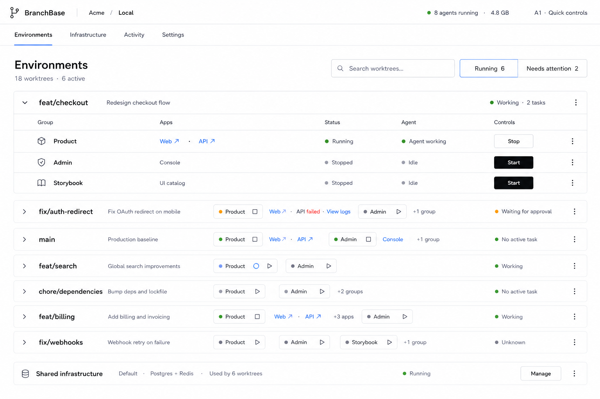
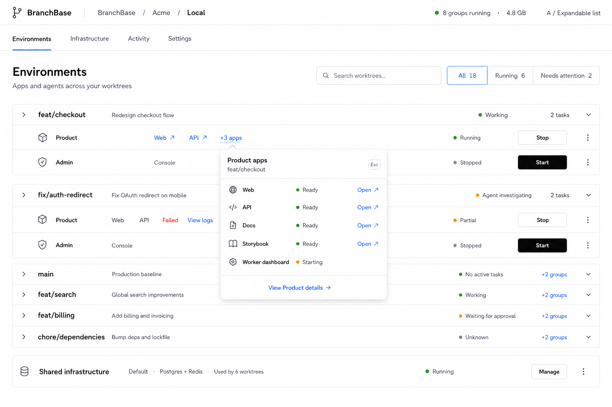
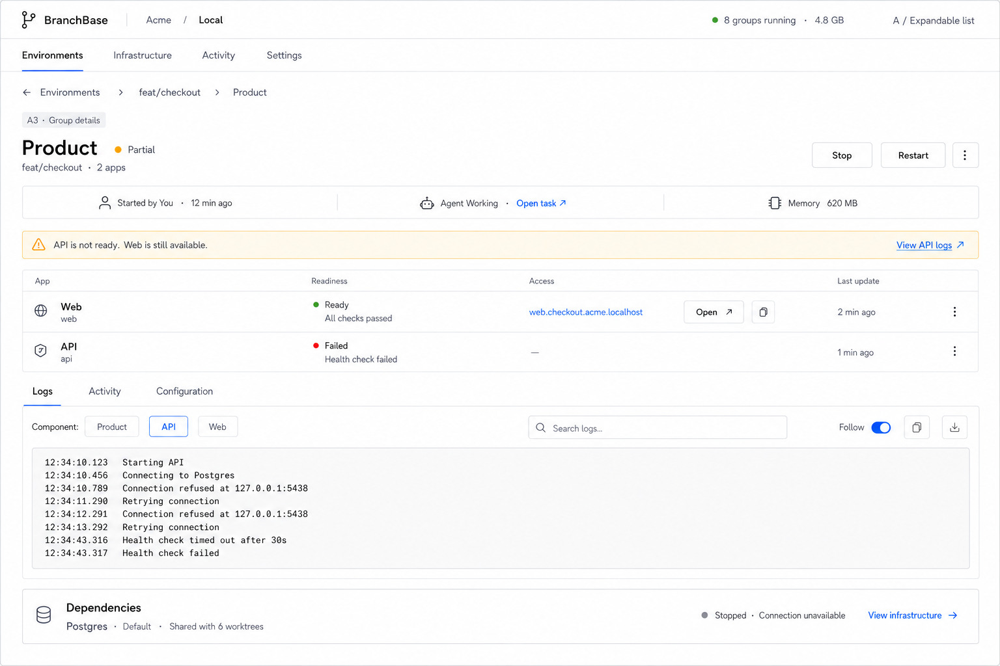

# BranchBase product design record

Accepted direction recorded on 2026-09-06. These visual references record the discussion; they are not an implementation specification or a claim that pictured capabilities exist. Implementation issues and PRDs belong in GitHub Issues.

## Product direction

Agents ordinarily create worktrees in their own tools. BranchBase discovers them and lets humans and agents operate their configured App groups. A human can start an App group and open a ready App without a terminal or asking an agent to run it. Monorepo support remains first class: a worktree is not reduced to a single App or preview action. Worktree creation inside BranchBase may remain a convenience.

## Accepted screen direction

Use the expandable worktree list (option A), with compact controls and App links available without expansion. Use overflow menus for additional items and a focused App-group detail surface for deeper investigation.

### A1: Quick controls

Collapsed rows expose App-group lifecycle controls and ready App links. Expansion reveals the complete group structure. Show up to two groups and two App links per visible group when space permits, with explicit additional-item counts. Allow a second line at narrower widths rather than squeezing names and controls.

### A2: App overflow

An explicit `+N apps` trigger opens a persistent menu with App names, Readiness, available Open actions, and navigation to the group's details. Use an equivalent `+N groups` trigger for additional App groups. Hover or focus may preview context; actions must also be reachable by click and keyboard. Do not rely on hover-only controls or nested hover panels.

### A3: Group details

The focused group surface provides endpoints, logs, lifecycle controls, and diagnostic context. Returning to the list preserves filters, scroll, and expansion. The image's resource figures, startup attribution, dependency presentation, and per-App log filtering are illustrative proposals, not existing feature guarantees.

## Interaction rules

- Start, Stop, and Restart act on App groups; Open acts on individual ready Apps.
- Expose Open only when Readiness and Route state permit it.
- Chevron expands, group name opens details, and App link opens the App.
- Keep control ordering stable as statuses change.
- Surface failures even when the affected App or group is in overflow.
- Keep agent activity at worktree level, separate from App-group status.
- Make shared-instance scope and affected consumers clear before lifecycle actions.
- Use restrained typography, spacing, and alignment with minimal container chrome.

## Image corrections and unresolved details

- A1 incorrectly includes a per-group Agent column; omit it. Its header says agents running where the intended resource summary counts running groups.
- A1 shows a Start affordance while Starting; duplicate starts must be prevented.
- A2 illustrates the overflow well but retains expanded background rows instead of the requested collapsed state. It also labels Product Running while one App is Starting; derive the summary consistently from actual observations.
- A3's “All checks passed” must not imply tests passed: Readiness concerns endpoint availability only.
- Final icon hit areas, menu focus behavior, responsive wrapping, summary counts, and exact wording require verification in an interactive implementation.
- Keyboard Space-to-peek is an optional exploration, not yet a committed feature.
- “Environments” is a proposed UI label; this record does not redefine the glossary or introduce a new configuration object.
- Projects, Infrastructure, Activity, and Settings screen direction and accompanying refinements were approved by the user on 2026-09-06. See [approved screens and remaining implementation details](project-tabs-proposals.md).

## Sources and generation

Generated with the built-in imagegen tool. Exact prompts and additional caveats are in [generation notes](screens/generation-notes.md).

- [Vercel product design](https://vercel.com/blog/teaching-agents-product-design-at-vercel)
- [Vercel Context Card](https://vercel.com/geist/context-card)
- [Vercel Tooltip](https://vercel.com/geist/tooltip)
- [Linear Peek](https://linear.app/docs/peek)

These sources informed the exploration; BranchBase's explicit product decisions and domain rules govern its behavior.

## Implementation and verification

The approved direction is now implemented. See the [implementation record](implementation.md) for migrated functionality, browser evidence, visual refinements, and the boundaries of measured runtime data. The original images remain unchanged as design references.
