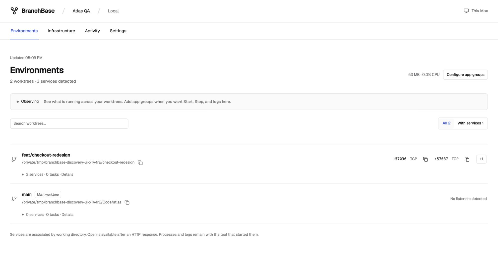
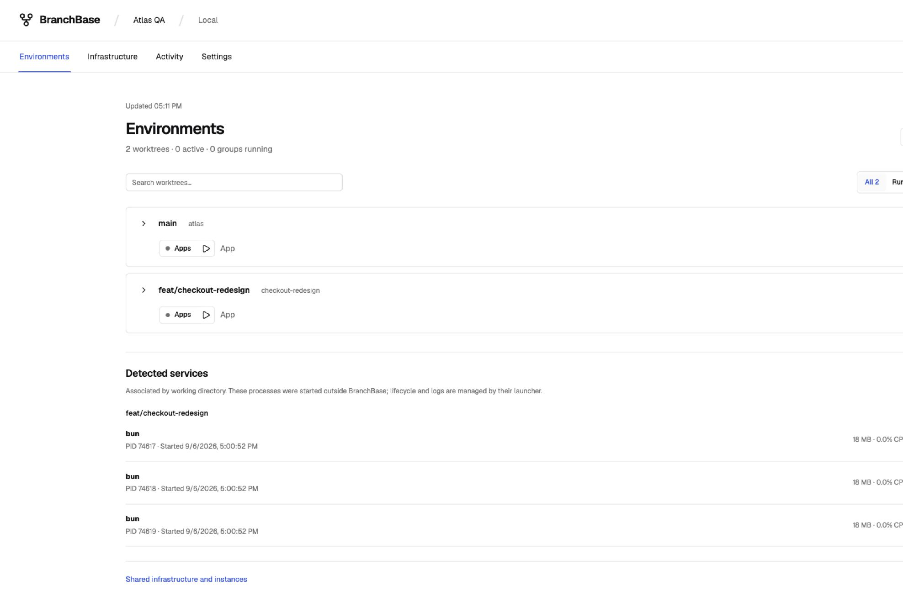
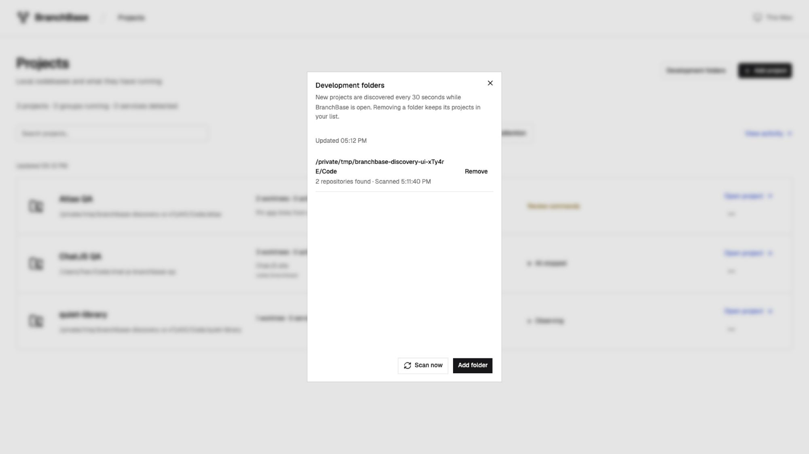

# Project discovery and observation

Implemented following the approved discovery-first direction, 2026-09-06.

A development folder is a user-selected directory whose repositories can be
added to the local project list. An observed project has useful worktree and
service views without a BranchBase configuration. Configured app groups retain
their existing lifecycle model; a detected listener is not automatically an App
or an App group.

## Product behavior

- Add a single Git repository or a development folder. Linked worktrees resolve
  to their primary repository, including worktrees outside the selected folder.
- Active projects sort before quiet projects. Search and the Running filter also
  include projects with detected listeners.
- Worktree rows expose two service links and a keyboard-accessible `+N` popover.
  Details show process name, PID, start time, sampled resources, and Codex tasks.
- Only an HTTP response enables Open. A listening TCP port alone is not evidence
  that a browser can use it. Failed HTTP rechecks remove Open; successful
  background rechecks retain the link without flickering during the request.
- Global BranchBase settings contains Appearance and Development folders, with
  connection details under collapsed Diagnostics. The Settings gear replaces the
  earlier This Mac entry; project settings remain scoped to their repository.
- Unconfigured projects use a neutral Observing state. Infrastructure explains
  the optional configuration step. Settings supports naming and configuration.
- Configured environments include a separate Detected services section for
  processes outside BranchBase's verified managed process trees.
- Configuration creation does not approve its command fingerprint. Unknown
  runtime commands are labeled as undetected and the starter requires editing.

## Observation limits

The host inspector is macOS-first. It samples up to 256 TCP listeners, resolves
working directories, and checks their Git roots before associating them with a
worktree. Nested repositories are not attributed to their enclosing repository.
Processes launched with unrelated working directories, containers, remote
services, Unix sockets, and non-listening background processes may be absent.
Inspection warnings are visible; an incomplete sample does not manufacture
service-disappearance events. CPU and RSS are samples of associated process
subtrees, deduplicated in the project total, not machine-wide resource usage.

Folder scans are bounded to three levels, 2,000 visited directories, and 100
repositories per folder, with at most 20 watched folders. Hidden directories,
common dependency/build directories and symlinks are skipped. Polling runs while
the dashboard is active, not as a filesystem watcher when the dashboard is closed.
History begins with observation. Persisted comparison baselines only deduplicate
activity events; live process inspection remains the source of current status.

## Verification

Bun tests cover bounded scanning, dependency/symlink exclusions, linked-worktree
deduplication, persisted folders, removal exclusions, missing folders, metadata
compatibility, nested Git root attribution, incomplete observation, command
approval after configuration, listener parsing, and HTTP verification. A macOS
test launches a real HTTP listener in an external linked worktree and checks its
association and resource usage. React rendering tests verify neutral states,
active sorting, copy-only TCP services, overflow affordances, and optional setup.

Browser verification used a temporary folder containing two repositories and an
external linked worktree with three independently launched Bun HTTP servers:

1. Added the development folder through the dialog; both projects appeared.
2. Confirmed the active project sorted first and exposed immediate service links.
3. Opened `+1`, verified its link and copy action, then dismissed with Escape.
4. Expanded process details and inspected resources and Codex task availability.
5. Renamed the project and reviewed the starter configuration.
6. Created the configuration; managed groups and detected services stayed separate.
7. Clicked Start and verified the command-approval dialog, then cancelled it.
8. Stopped only the test servers and verified three disappearance activity entries.
9. Rescanned and removed the development folder; projects remained in the list.
10. Removed the temporary projects. The original configured project was preserved.

Final checks: `bun lint`, `bun test:types`, `bun test` (212 passed, one optional
Codex compatibility test skipped), and `bun run build` passed. Vite reports a
611 kB main bundle size advisory; no build errors.

The inspected desktop page was 1600 × 900 CSS pixels with no horizontal overflow
and no browser warning/error logs after the final reload. Mobile-specific visual
verification was not performed. Existing async-state tests cover initial failure,
loading, read-only retries, retained stale content, and reserved layout regions.

