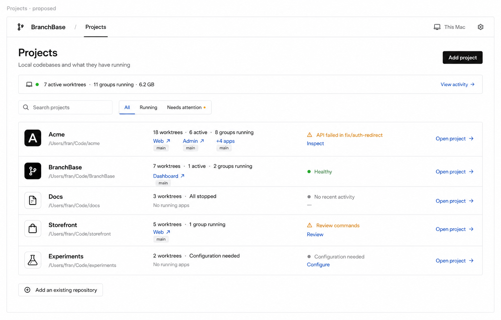
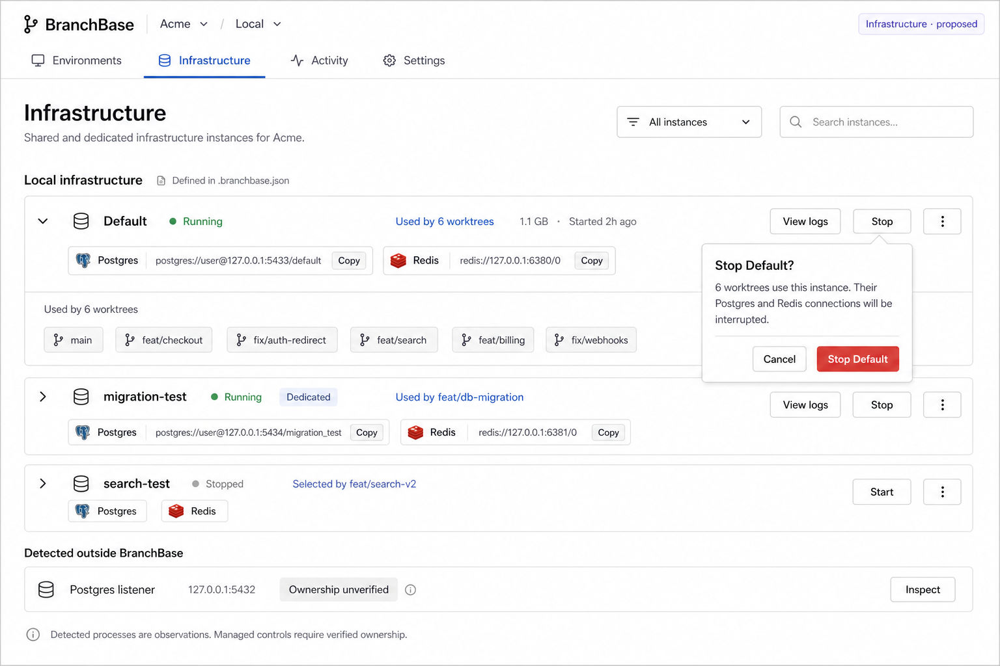
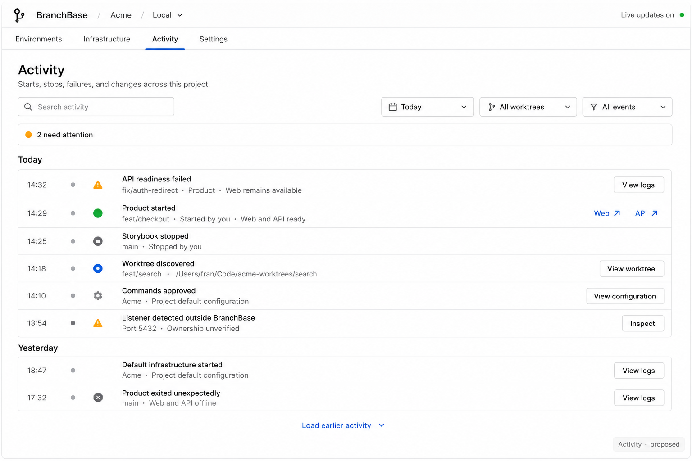
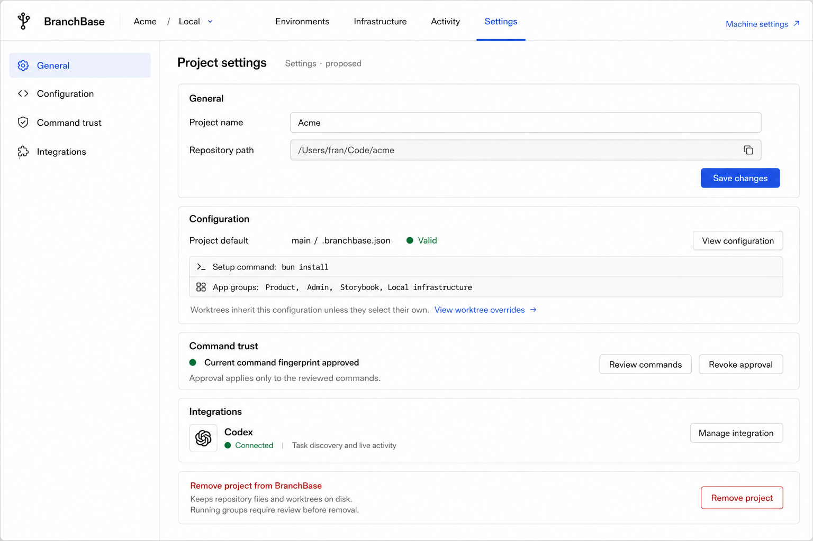

# Approved project and tab screen direction

Approved by the user on 2026-09-06, including the accompanying refinements below.
These screens extend the accepted expandable-list direction. Approval establishes
the product and visual direction; it does not claim implementation is complete or
resolve every technical detail. Existing `.branchbase.json` configuration and
command-fingerprint approval remain authoritative. Generated using built-in imagegen;
the original image filenames, proposal labels, and prompts are retained as provenance.

## Approved refinements

- Projects uses pinned ready App links qualified by worktree, with one Add project
  entry point and no redundant bottom Add button.
- Infrastructure classification is explicit in repository configuration. Selected
  worktrees and verified active consumers are distinct.
- Activity focuses on operational history; raw logs remain in App-group details.
- Settings displays one section at a time, with machine settings separate.

## Projects

Show repository identity and path, worktree and running-group counts, important
exceptions, and a few ready App links qualified by worktree. Opening a project
lands on its Environments list. Add project is the primary creation action. Avoid
project-wide lifecycle controls without explicit group and instance scope.

Use the illustrated list direction and pinned links. Remaining implementation details
include pin management and defining active from runtime activity rather than agent
activity. Never assume a branch named main is a product convention.

## Infrastructure

Show each configured infrastructure instance once, its Apps and connection details,
selected worktrees, current readiness, and instance-scoped lifecycle controls.
Shared Stop reveals affected consumers. Differentiate worktrees selecting an
instance from verified active consumers; selection alone does not prove usage.

Implementation constraints: classification must be explicit in repository configuration, not
inferred from names such as Infrastructure, Postgres, or Redis. Infrastructure is
not currently a distinct domain entity. A named selectable instance with one
consumer is not automatically dedicated. Consider whether broader process discovery
belongs in a machine-wide surface; only project-associated observations belong here.
Resource attribution and external-process discovery are proposed capabilities.
Connection URIs pictured are illustrative; do not fabricate credentials or expose
secret values. The trusted Stop command determines consequences: do not universally
promise that stopping preserves data without verifying its behavior.

## Activity

Show operational events: starts, stops, readiness failures, discoveries, configuration
and trust changes. Include timestamp, worktree, group or instance, available evidence
about initiator, and direct navigation to diagnostics. Filter by time, worktree, and
event type. Raw logs belong in group details; this surface is not an agent transcript.

Durable event history, retention, attribution, and live updates are proposed work.
Unknown initiators remain unknown. Historical events may link to current Apps only
when their present Readiness and Route state make those links valid. A failure event
is not necessarily an unresolved issue; attention counts require current evidence.

## Settings

Separate General, Configuration, Command trust, and Integrations. Project default
configuration and worktree override selection preserve the accepted configuration
model. Show exact reviewed fingerprints and scope for command trust. Keep machine
routing, daemon preferences, and appearance in machine settings.

Open choices: editable project labels, approval revocation scope and consequences,
project removal behavior, and integration availability. Review before removal must
account for owned processes and shared-instance consumers. Removing a tracked project
must not silently imply deleting repository files or worktrees. Images show proposed
UI, not an implementation of these capabilities.

## Visual review notes

Numbers and state labels are illustrative. Summary counts must be derived from a
consistent snapshot and shared instances counted once. Settings should open on one
coherent section rather than displaying every subsection as duplicated overview
content. Projects needs only one Add project entry point; remove redundant bottom
creation action. Replace vague Healthy with a precise runtime summary.

The generation prompts below are preserved as historical imagegen inputs. For
current implementations, the approved guidance supersedes conflicting prompt
details: Settings opens one section at a time; Projects has one Add project
entry point with a runtime summary such as worktree and running-group counts;
and the redundant bottom Add button is omitted.

## Generation prompts

### Projects

Use case: ui-mockup. Create one high-fidelity desktop BranchBase product screenshot concept, wide landscape, sharp readable text. Vercel Geist / Linear style: white, nearly black sans-serif text, subtle gray one-pixel borders, compact 6px corners, blue text links and selected underline, green running dot amber warnings gray stopped; excellent spacing and alignment, 14px-style readable body text. No gradients, giant metric cards, decorative charts, marketing heroes, browser chrome or permanent inspector. Brand BranchBase simple branch glyph. Local development manager for AI-era monorepos, agents create worktrees externally; human starts/stops app groups and opens apps. Existing domain app groups start/stop together and contain multiple app endpoints; shared instances may be selected across worktrees. Concept data and proposed capabilities illustrative. Compact neutral buttons, destructive operations clearly scoped. Header and project tabs consistent with previous A screen. SCREEN: Global Projects overview, NOT worktrees. Header BranchBase / Projects, far right 'This Mac' and small Settings gear. Heading Projects, description 'Local codebases and what they have running'. Top right black 'Add project' button. Compact machine strip '7 active worktrees · 11 groups running · 6.2 GB' with quiet 'View activity →'. Search projects input; All / Running / Needs attention filters. Show five large horizontal project rows separated by thin rules, with clear project name, muted canonical path, operational summary, recent activity, and Open project arrow on far right. Acme /Users/fran/Code/acme, '18 worktrees · 6 active · 8 groups running', ready app links 'Web ↗ Admin ↗ +4 apps' each labeled subtly 'main', small amber 'API failed in fix/auth-redirect' with Inspect. BranchBase /Users/fran/Code/BranchBase '7 worktrees · 1 active · 2 groups running', 'Dashboard ↗' qualified main; green Healthy. Docs /Users/fran/Code/docs '3 worktrees · All stopped', No running apps. Storefront '5 worktrees · 1 group running', 'Review commands' amber trust state, link Review (not start). Experiments '2 worktrees · Configuration needed', Configure link. Important project row click navigates to its Environments; NO project-level Start all or Stop all because lifecycle scoped to groups. Keep unknown data as em dash, muted paths secondary. Bottom quiet button 'Add an existing repository'. At top small neutral design label 'Projects · proposed'. UI should be attractive and credible with comfortable density.

### Infra

Use case: ui-mockup. Create one high-fidelity desktop BranchBase product screenshot concept, wide landscape, sharp readable text. Vercel Geist / Linear style: white, nearly black sans-serif text, subtle gray one-pixel borders, compact 6px corners, blue text links and selected underline, green running dot amber warnings gray stopped; excellent spacing and alignment, 14px-style readable body text. No gradients, giant metric cards, decorative charts, marketing heroes, browser chrome or permanent inspector. Brand BranchBase simple branch glyph. Local development manager for AI-era monorepos, agents create worktrees externally; human starts/stops app groups and opens apps. Existing domain app groups start/stop together and contain multiple app endpoints; shared instances may be selected across worktrees. Concept data and proposed capabilities illustrative. Compact neutral buttons, destructive operations clearly scoped. Header and project tabs consistent with previous A screen. SCREEN: Project Infrastructure tab. Header BranchBase / Acme / Local; tabs Environments, Infrastructure SELECTED, Activity, Settings. Heading Infrastructure, subtitle 'Shared and dedicated infrastructure instances for Acme'. Filter 'All instances' plus search. No generic provisioning wizard. Group section 'Local infrastructure' beneath title, tiny 'Defined in .branchbase.json' secondary detail only. Three instance cards presented as flat horizontal roomy rows. First 'Default' green Running; Postgres and Redis endpoint chips with Copy connection actions, 'Used by 6 worktrees' clickable, '1.1 GB · Started 2h ago'; buttons View logs, Stop, overflow aligned right. Under first show expanded consumer list as six branch chips: main, feat/checkout, fix/auth-redirect, feat/search, feat/billing, fix/webhooks. Second instance 'migration-test' green Running, label Dedicated, 'Used by feat/db-migration', Postgres and Redis copy connections, View logs Stop overflow. Third 'search-test' gray Stopped, 'Selected by feat/search-v2', names Postgres Redis without active connections, Start button. Small separate lower section 'Detected outside BranchBase' with one row Postgres listener '127.0.0.1:5432', gray 'Ownership unverified', Inspect button; no Stop or adopt button. Compact information text 'Detected processes are observations. Managed controls require verified ownership.' Show ONE small open contextual inline confirmation beneath Default Stop: title 'Stop Default?', description '6 worktrees use this instance. Their Postgres and Redis connections will be interrupted.', Cancel / Stop Default. This is a review of shared action scope, not a full-screen modal. Do not imply database deletion. Small label 'Infrastructure · proposed'.

### Activity

Use case: ui-mockup. Create one high-fidelity desktop BranchBase product screenshot concept, wide landscape, sharp readable text. Vercel Geist / Linear style: white, nearly black sans-serif text, subtle gray one-pixel borders, compact 6px corners, blue text links and selected underline, green running dot amber warnings gray stopped; excellent spacing and alignment, 14px-style readable body text. No gradients, giant metric cards, decorative charts, marketing heroes, browser chrome or permanent inspector. Brand BranchBase simple branch glyph. Local development manager for AI-era monorepos, agents create worktrees externally; human starts/stops app groups and opens apps. Existing domain app groups start/stop together and contain multiple app endpoints; shared instances may be selected across worktrees. Concept data and proposed capabilities illustrative. Compact neutral buttons, destructive operations clearly scoped. Header and project tabs consistent with previous A screen. SCREEN: Project Activity tab. Header BranchBase / Acme / Local; tabs Environments, Infrastructure, Activity SELECTED, Settings. Heading Activity, description 'Starts, stops, failures, and changes across this project'. Toolbar search activity, Today dropdown, All worktrees dropdown, All events dropdown. Compact strip '2 need attention' with amber dot not stat card. Chronological timeline list grouped Today then Yesterday, timestamp fixed narrow left column, small event icon, primary text, secondary context, action right. Events: 14:32 amber 'API readiness failed' second line 'fix/auth-redirect · Product · Web remains available' button View logs; 14:29 green 'Product started' second line 'feat/checkout · Started by you · Web and API ready' app links Web ↗ API ↗; 14:25 gray 'Storybook stopped' second line 'main · Stopped by you'; 14:18 blue 'Worktree discovered' second line 'feat/search · /Users/fran/Code/acme-worktrees/search' View worktree; 14:10 neutral 'Commands approved' second line 'Acme · Project default configuration' View configuration; 13:54 amber 'Listener detected outside BranchBase' second line 'Port 5432 · Ownership unverified' Inspect. Yesterday two muted rows 'Default infrastructure started' and 'Product exited unexpectedly', View logs. Events are runtime/ownership/config history, NOT agent conversations, tool-call feed, Git commit activity, or raw stdout. No invented author attribution for unknown events, no chat composer. Right aligned quiet 'Live updates on' top with small green dot, bottom 'Load earlier activity'. Small label 'Activity · proposed'.

### Settings

Use case: ui-mockup. Create one high-fidelity desktop BranchBase product screenshot concept, wide landscape, sharp readable text. Vercel Geist / Linear style: white, nearly black sans-serif text, subtle gray one-pixel borders, compact 6px corners, blue text links and selected underline, green running dot amber warnings gray stopped; excellent spacing and alignment, 14px-style readable body text. No gradients, giant metric cards, decorative charts, marketing heroes, browser chrome or permanent inspector. Brand BranchBase simple branch glyph. Local development manager for AI-era monorepos, agents create worktrees externally; human starts/stops app groups and opens apps. Existing domain app groups start/stop together and contain multiple app endpoints; shared instances may be selected across worktrees. Concept data and proposed capabilities illustrative. Compact neutral buttons, destructive operations clearly scoped. Header and project tabs consistent with previous A screen. SCREEN: Project Settings, overview selected. Header BranchBase / Acme / Local; tabs Environments, Infrastructure, Activity, Settings SELECTED. Heading Project settings. Small internal navigation on left ~190px: General selected, Configuration, Command trust, Integrations. Main body settings groups separated by whitespace and subtle borders. First group General: Project name Acme editable input, repository path /Users/fran/Code/acme read-only with copy icon, button Save changes scoped to this form. Second group Configuration: 'Project default' value 'main / .branchbase.json', green Valid, button View configuration; two small neutral rows 'Setup command: bun install', 'App groups: Product, Admin, Storybook, Local infrastructure'. Text 'Worktrees inherit this configuration unless they select their own.' link 'View worktree overrides →'. Do not add GUI JSON editor or arbitrary project-name conventions. Third group Command trust: 'Current command fingerprint approved', green dot, 'Approval applies only to the reviewed commands.', buttons Review commands and neutral Revoke approval. Fourth group Integrations: Codex 'Connected' green; 'Task discovery and live activity', Manage integration button. Footer clearly separated quiet 'Remove project from BranchBase' with red outline Remove project button and text 'Keeps repository files and worktrees on disk. Running groups require review before removal.' Do not show automatic deletion or automatic kill claim. Small muted top link 'Machine settings ↗' distinguishes global routing/daemon preferences from project settings. No themes mixed into project settings, no billing, no team seats, no cloud deployment. Small label 'Settings · proposed'.
